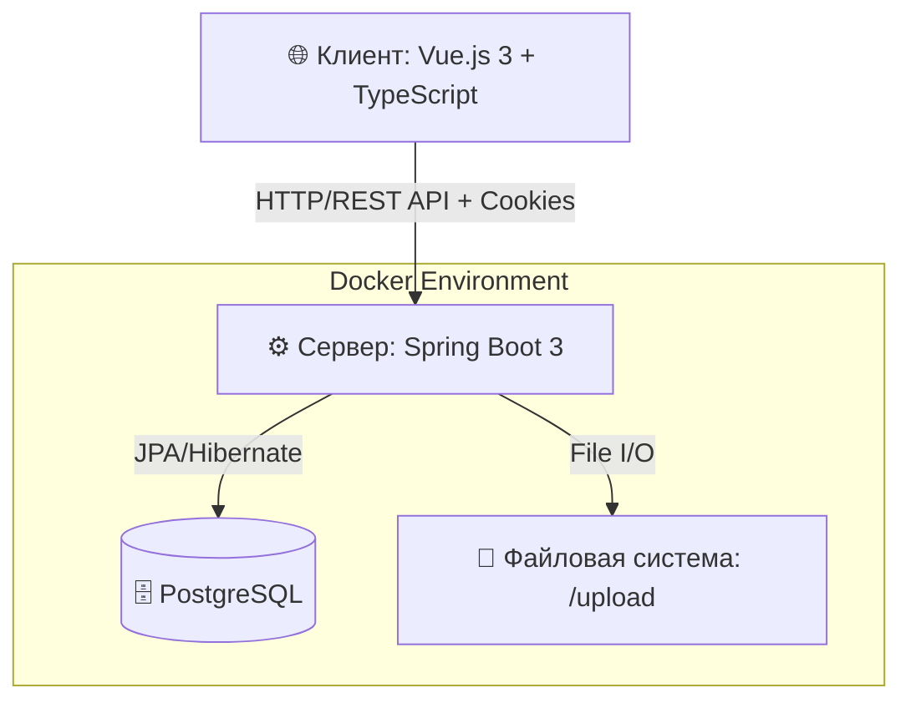

# ☁️ Дипломная работа: Облачное хранилище файлов

Полнофункциональное облачное хранилище файлов, разработанное в качестве дипломного проекта. Приложение позволяет пользователям авторизовываться и управлять своими файлами (загрузка, скачивание, переименование, удаление) через современный веб-интерфейс.

---

## 📑 Оглавление
1. [Архитектура приложения](#-архитектура-приложения)
2. [Хранение данных и настроек](#-хранение-данных-и-настроек)
3. [Структура базы данных](#-структура-базы-данных)
4. [Быстрый старт](#-быстрый-старт)
5. [Тестирование](#-тестирование)

---

## 🏗 Архитектура приложения

Приложение построено по классической клиент-серверной архитектуре с четким разделением ответственности:

Ключевые особенности:
- Аутентификация: Токен (auth-token) выдается при логине, сохраняется в cookies на фронтенде и передается в заголовках запросов через Axios interceptors.
- Разделение данных: Метаданные файлов хранятся в реляционной БД, а сами бинарные данные (тела файлов) — в файловой системе сервера.

##  Технологический стек

Backend:
- Язык: Java 17
- Фреймворк: Spring Boot 3.2.5 (Web, Data JPA)
- База данных: PostgreSQL 16 (Production), H2 (Unit-тесты)
- Тестирование: JUnit 5, Mockito, Testcontainers (PostgreSQL для интеграционных тестов)
- Утилиты: Lombok, Gradle

Frontend:
- Фреймворк: Vue.js 3 (Composition API)
- Язык: TypeScript
- Стейт-менеджмент: Vuex
- HTTP-клиент: Axios (с интерсепторами для автоматической подстановки токенов и обработки ошибок 401)

DevOps:
- Контейнеризация: Docker, Docker Compose

## 💾 Хранение данных и настроек

| Тип данных | Место хранения | Подробности |
| :--- | :--- | :--- |
| Настройки Backend | cloud/src/main/resources/application.yml | URL БД, учетные данные, ddl-auto, порт сервера (8080). |
| Настройки Frontend | netology-diplom-frontend/.env | Базовый URL API (VUE_APP_BASE_URL=http://localhost:8080). |
| Метаданные файлов | PostgreSQL, таблица files | Имя, размер, путь, дата изменения, связь с пользователем. |
| Тела файлов (Blob) | Файловая система сервера | Папка cloud/upload/. Примонтирована как Docker Volume для сохранения данных между перезапусками контейнеров. |

## 🗄 Структура базы данных

Приложение использует две основные сущности со связью One-to-Many (Один пользователь может иметь много файлов).

### Таблица users

| Поле | Тип | Описание | Ограничения |
| :--- | :--- | :--- | :--- |
| id | BIGSERIAL | Уникальный идентификатор | Primary Key |
| login | VARCHAR(255) | Логин пользователя | UNIQUE, NOT NULL |
| password | VARCHAR(255) | Хэш пароля | NOT NULL |

### Таблица files

| Поле | Тип | Описание | Ограничения |
| :--- | :--- | :--- | :--- |
| id | BIGSERIAL | Уникальный идентификатор | Primary Key |
| filename | VARCHAR(255) | Оригинальное имя файла | NOT NULL |
| size | BIGINT | Размер файла в байтах | NOT NULL |
| file_path | VARCHAR(255) | Относительный путь в файловой системе | NOT NULL |
| edited_at | TIMESTAMP | Дата последнего изменения | Default NOW() |
| user_id | BIGINT | Владелец файла | Foreign Key → users(id), ON DELETE CASCADE |

## 🚀 Быстрый старт

### Предварительные требования
- Установленные Docker и Docker Compose
- Node.js (версия 18+) для запуска фронтенда

### 1. Запуск Backend (через Docker)

Откройте терминал и выполните:

    cd cloud
    docker-compose up --build -d

Флаг -d запустит контейнеры в фоновом режиме. Бэкенд будет доступен на http://localhost:8080.

### 2. Запуск Frontend

Откройте новый терминал:

    cd netology-diplom-frontend
    npm install
    npm run serve

Приложение будет доступно по адресу: http://localhost:8081

### 3. Вход в систему

Используйте тестовые учетные данные (создаются автоматически при первом запуске БД):
- Логин: admin
- Пароль: admin123

## 🧪 Тестирование

Проект покрыт модульными и интеграционными тестами (включая Testcontainers). Для запуска используйте:

    cd cloud
    ./gradlew test

## 📂 Структура проекта
'''
cloud/                          # Backend модуль
── src/main/java/netology/cloud/
│   ├── config/                 # Конфигурация CORS и Security
│   ├── controller/             # REST API endpoints
│   ├── dto/                    # Data Transfer Objects
│   ├── entity/                 # JPA Entities (User, File)
│   ├── repository/             # Spring Data JPA интерфейсы
│   └── service/                # Бизнес-логика
├── src/test/                   # Unit и Integration тесты
├── upload/                     # Директория для хранения файлов (игнорируется в Git)
├── build.gradle                # Зависимости и настройки сборки
├── Dockerfile                  # Образ для backend
└── compose.yaml                # Оркестрация Backend + PostgreSQL

netology-diplom-frontend/       # Frontend модуль
├── src/
│   ├── api/                    # Axios client и запросы
│   ├── components/             # Переиспользуемые UI компоненты
│   └── views/                  # Страницы (Login, Home)
├── package.json
└── .env                        # Переменные окружения
'''
## 👤 https://github.com/esprakta / @Delementa
